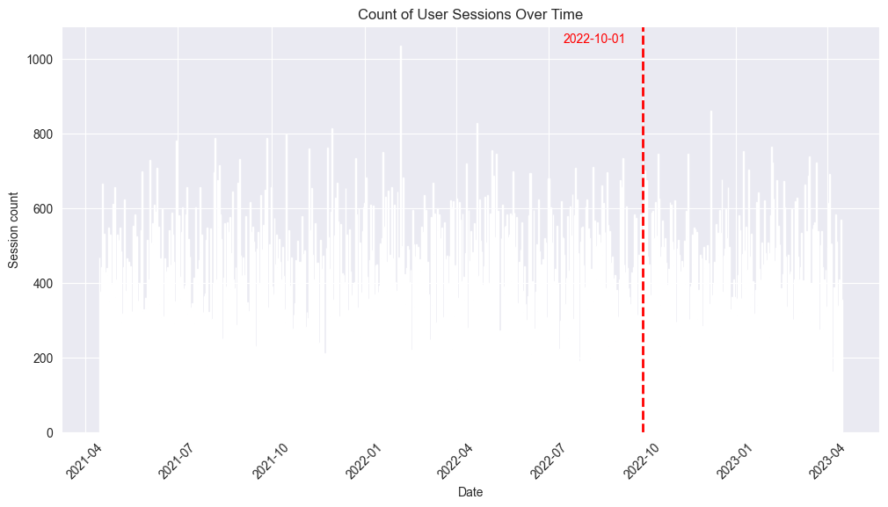
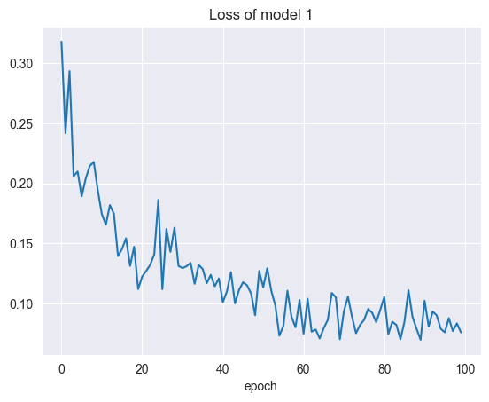
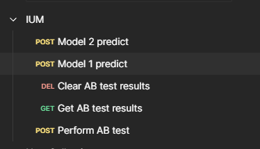

# IUM
## System rekomendacji utworów

### Poniższy raport przedstawia:
- opis wykorzystywanych modeli
- trening modeli
- porównanie wyników modeli
- implementację mikroserwisu
- testy A/B

### Wykorzystane dane

W rozwiązaniu wykorzystano zbiory danych:
- tracks
- sessions
- users

Dodatkowo modele są trenowane na danych do dnia `2022-09-01`. Rekomendacje są tworzone na bazie ostatniego miesiąca sesji danego użytkownika.
Modele są walidowane bazując na rekomendacjach i na kolejnym miesiącu odsłuchań użytkownika, tj. `2022-09-01`.




Dodatkowo zbiór `sessions` został ograniczony do użytkowników o id: `141, 167, 200, 206, 237, 281, 287, 297, 301, 324, 362, 386, 394, 418, 429, 433, 434, 442, 486, 505`
dane sesji użytkowników. Zdecydowano się na taki krok, ponieważ filtrowanie odpowiednich rekordów po danym czasie i użytkowniku zajmuje znaczą część czasu, obniżając wydajność systemu.
Klient będzie zobowiązany do zaimplementowania wydajnej bazy danych i zapytań `.sql` zwracających rekordy sesji. Przygotowano odpowiednie skrypty na integrujące zewnętrze api klienta do baz danych.

### Model 1 - Autoenkoder

Opis modelu znajduje się w pliku `model1_ae.ipynb`.

Autoenkoder składa się z kodera i dekodera.
Koder uczy się kodować dane wejściowe do reprezentacji przestrzeni ukrytej
o wyższym wymiarze, podczas gdy dekoder rekonstruuje oryginalne dane z przestrzeni ukrytej.

Po wytrenowaniu autoenkodera wykorzystywana jest część kodera do zakodowania utworu,
którego rekomendacje są poszukiwane, przechwytując jej charakterystykę zbudowaną
przez model w przestrzeni ukrytej.
Porównując zakodowaną reprezentację ścieżki z innymi zakodowanymi
reprezentacjami jesteśmy w stanie znaleźć utwory mające podobne warotści atrybutów
w przestrzeni ukrytej.

Podczas treningu osiągnięto zadowalający błąd między rzeczywistymi danymi a rekonstrukcjami.



### Model 2

Opis modelu znajduje się w pliku.

### Uruchomienie

Poniższa instrukcja ukazuje jak krok po korku wykorzystywać serwis:

1. Przejść do katalogu `microservice` oraz zainstalować potrzebne pakiety `python` za pomocą polecenia:

`
pip install -m requirements.txt
`

2. uruchomić skrypt `./run.sh`
Uruchomi on mikroserwis pod lokalnym adresie: `127.0.0.1:8000`

Należy odczekać kilka sekund, aż serwis będzie aktywny. Poniższe komunikaty wskazują na zakończenie startu serwisu.

```
INFO:     Started server process [24360]
INFO:     Waiting for application startup.
INFO:     Application startup complete.
```

3. Uruchomić aplikację [Postman](https://www.postman.com/downloads/) i załadować plik konfiguracji: `postman_collections.json`.
4. Korzystając z wyświetlających się endpointów można korzystać z serwisu



### Opis Endpointów

Plik postman_collection.json to kolekcja Postmana zawierająca wszystkie endpointy.


#### `POST /perform_ab_test`

Służy do zbierania danych do testów A/B. Zwraca czy rekomendacje okazały się poprawne czy nie, dla danego użytkownika.

```
{
    "user_id": 429
}
```
Przykładowa odpowiedź: `{"Successful recommendation": 1}`

#### `DELETE /ab_test/results`

Czyści plik przechowujący wyniki testów A/B.

#### `GET /ab_test/results`

Zwraca zawartość pliku przechowujący wyniki testów A/B.

#### `POST /models/{model_id}/predict`

Zwraca predykcję dla danego modelu.

- model_id = 1: Enkoder
- model_id = 2: Klasyfikator

Dane wejściowe i wyjściowe są w takim samym formacie.

Zwraca listę zawierającą `track_id` rekomendowanych piosenek.

Przykładowa odpowiedź:

```
[
    "0ofHAoxe9vBkTCp2UQIavz",
    "6zFMeegAMYQo0mt8rXtrli",
    "5vGLcdRuSbUhD8ScwsGSdA",
    "4xqrdfXkTW4T0RauPLv3WA",
    "1KixkQVDUHggZMU9dUobgm",
    "54bFM56PmE4YLRnqpW6Tha",
    "1tkg4EHVoqnhR6iFEXb60y",
    "7vrJn5hDSXRmdXoR30KgF1",
    "45bE4HXI0AwGZXfZtMp8JR",
    "35mvY5S1H3J2QZyna3TFe0",
    "3YJJjQPAbDT7mGpX3WtQ9A",
    "3FAJ6O0NOHQV8Mc5Ri6ENp",
    "6f3Slt0GbA2bPZlz0aIFXN",
    "0VjIjW4GlUZAMYd2vXMi3b",
    "6tDDoYIxWvMLTdKpjFkc1B",
    "5QO79kh1waicV47BqGRL3g",
    "2gMXnyrvIjhVBUZwvLZDMP"
]
```
## Results
For the business criterium of at least 1 recommended on playlist track to be fully played by user, the models scored on AB tests as follows:

| **model AE** | **model classifier** |
| :---: | :---: |
| 70% | 30% |

The results indicate following conclusions:
* _The more effective approach with usage of ANN is with Autoenkoder latent space search_
* Further architectures must be verified

## Discussion
The AE model is most similar to representation learning. This way, the recommended tracks are similar to tracks listened by the user. The effects were acceptable, however the moethod may in a long term result in user being trapped in sort of **echo chamber**, as the tracks will be similar only to tracks he listened.

On the other hand, the classifier model attempted to solve a problem via classifying the preference of user towards each track. As the input is based not only on the hstory of listened tracks, but also user preference, there is a hope of classifying the track out of users mainstream listening preference as interesting. Nevertheless, this approach has many downsides: (1) very expensive & long training, (2) necessity of running the whole model with each and every track we are thinking of proposing, (3) constant results for given users, (4) the model is very prone to overfitting. As a result of above, the buisness criteria accuracy achived by this model were unacceptable.

## Conclusion
The results indicate the better approach to the given problem by usage of ANN is representation learning crossed with K-Nearest Neighbours algorithm then track preference classification.


